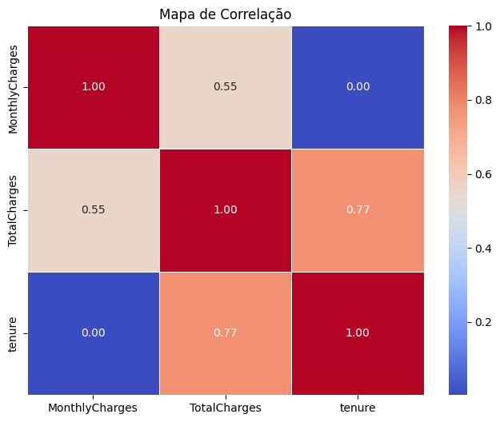
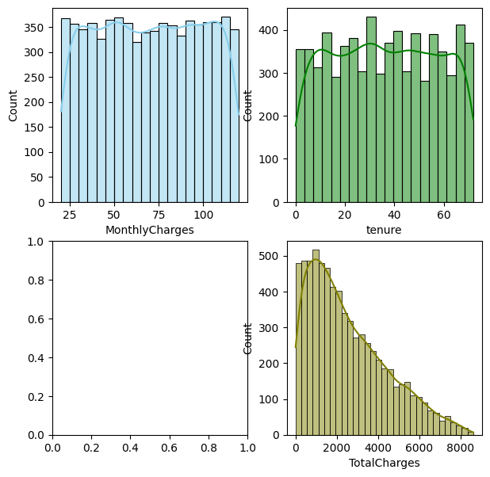
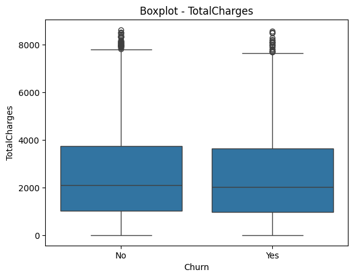
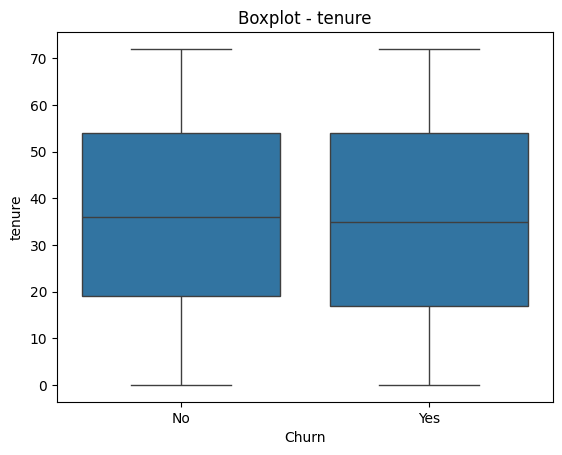
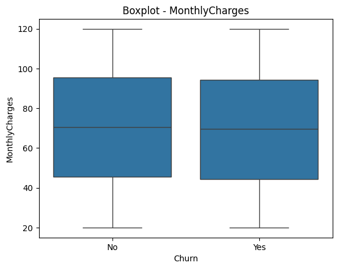
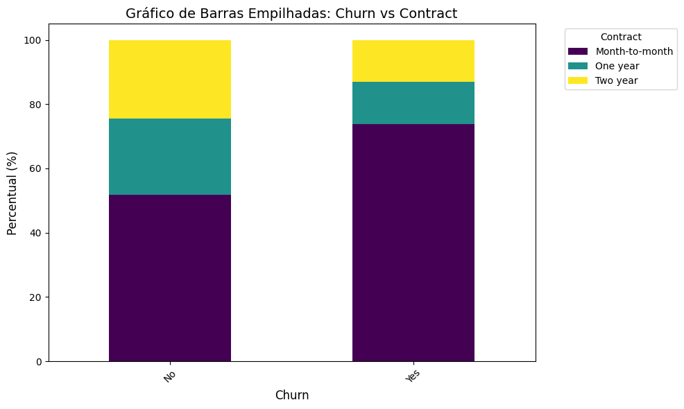
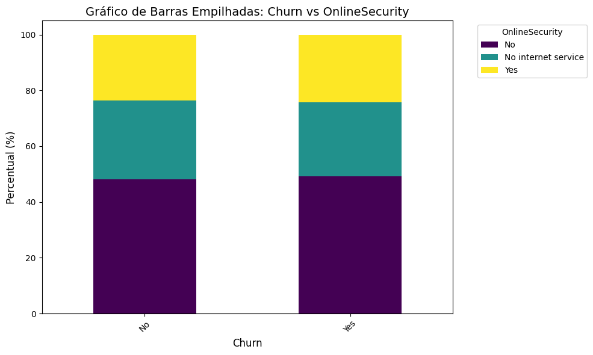
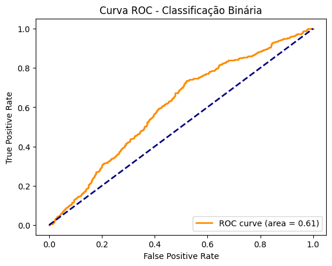

[Uploading README.md…]()
# 🔍 Modelo de Classificação - Churn 

Este repositório apresenta um projeto prático de modelos de classificação, utilizando técnicas de aprendizado supervisionado usada para problemas de classificação binária. A aplicação foi desenvolvida com Python, utilizando bibliotecas populares de ciência de dados.
---
## 🎯 Objetivo
Uma empresa de telecomunicações quer reduzir a rotatividade de clientes (“churn”). Seu 
papel é entregar um pipeline de dados que identifique quais clientes têm maior 
probabilidade de cancelar o serviço, apoiando ações de retenção.
Portanto, o intuito deste projeto é:
- Realizar uma Análise Descritiva dos dados para entender o comportamento dos clientes;
- Treinar modelos de classificação
- Avaliar os resultados e métricas de desempenho entre tais modelos e definir o modelo vencedor
---

## 🧰 Tecnologias Utilizadas

- Python 3.x
- Xgboost
- [NumPy](https://numpy.org/)
- [Pandas](https://pandas.pydata.org/)
- [Matplotlib](https://matplotlib.org/)
- [Scikit-learn](https://scikit-learn.org/)

### 📦 Instalação dos Pacotes
```bash
   pip install -r requirements.txt
```
---

## 📁 Estrutura do Projeto
```
analises/
├── data/           # Dados utilizados (CSV ou outros formatos)
├── imagens/        # imagens dos resultados para o README
├── notebooks/      # Notebooks com código e análises
├── requirements.txt # Bibliotecas a serem instaladas
└── README.md       # Documentação do projeto
```

---
## ▶️ Como Executar

1. Clone o repositório:
```bash
   git clone https://github.com/marcosdouglas11/Analise.git
```

2. Navegue até a pasta:
```bash
   cd notebooks
```

3. Execute os notebooks:
```bash
   01_EDA 02_Modeling
```
---
## Base de Dados
Conjunto de dados com x clientes. Baseado em características desses cliente, o intuito foi avaliar a probabilidade de "Churn", ou seja o cancelamento. 
As principais variáveis obtidas no conjunto de dados são:


• customerID (ID)

• gender, 

• SeniorCitizen, 

• Partner, 

• Dependents

• tenure, 

• PhoneService, 

• InternetService, 

• Contract, 

• PaperlessBilling, 

• PaymentMethod

• MonthlyCharges, 

• TotalCharges

• Churn (variável-alvo: “Yes”/“No”)


## 📊 Resultados

- Análise descritiva:
  
  Com o intuito de avaliar o comportamento dos dados, análises gráficas, tabulares e análises descritivas foram feitas. As Figuras a seguir ilustram alguns desses resultados:
><div align="center"></div>
Após uma análise de correalação, pôde-se verificar a existência de uma correlação linear forte entre a variável Tenure e TotalCharges. Sendo assim, para o modelo, necessário utilizar somente uma ou realizar uma redução de dimensionalidade.

><div align="center"></div>
Por meio dos Histogramas acima, foi possível verificar o comportamento das variáveis numéricas, mostrando a distribuição dos dados. Nota-se que a TotalCharges possui uma assimetria à direita, já a Tenure e MonthlyCharges se assemelham a distribuições Uniforme.

><div align="center"></div>
><div align="center"></div>
><div align="center"></div>
Após realizar uma análise bivariada entre as variáveis numéricas e a variável resposta: Churn, trazendo algumas medidas descritivas como: média, mediana e desvio padrão, foi possivel ver que não existe uma distinção discrepante entre os grupos do Churn (Yes; No), mostrando que em média o valor do TotalCharges fica em torno de 2562.1 para o que não teve cancelamento versus 2472.5 para o que teve cancelamento. 
Assim como na MonthlyCharges, nota-se uma mediana em torno de 70.7 para o cliente que não realizou o cancelamento versus 69.5 para o cliente que realizou o cancelamento. E o mesmo comportamento similar na variável Tenure, mostrando uma média de 36.4 para o cliente que não realizou o cancelamento versus 35.6 para o cliente que realizou o cancelamento.
><div align="center"></div>
><div align="center"></div>
    
 
- Modelos de Classificação:
  
  Para os modelos de classificação, inicialmente foram testadas todas as variáveis do conjunto de dados, no entanto, considerando que algumas influenciavam na redução dos valores das métricas de desempenho, foram retiradas tais variáveis. E ainda no caso em que houve correlação linear entre variáveis numéricas, foram consideradas somente uma entre essas correlacionadas para evitar questões de multicolinearidade.
  Em relação a partição das bases, foi realizada uma separação em base de treino, teste e validação. Sendo assim, nesta etapa inferencial, foram testados 4 modelos de classificação, sendo: Decision tree, Random Forest, Xgboost e Naive Bayes. Portanto, a seguir podemos observar tais resultados:
  
  ## Decision Tree
  >##### Base de Teste - Churn
>|Modelo|   Acurácia|   Precisão|   Recall| F1 Score|
>|------|------------|-----------|---------|---------|
>|Decision Tree|    0.56|    0.37|      0.37|     0.37|
>|Random Forest|    0.59|     0.39|     0.26|   0.31|
>|XGBoosting|     0.60|     0.39|     0.27|     0.32| 
>|Naive Bayes|    0.59|     0.43|     0.53   |0.48|

>  >##### Base de Validação - Churn
>|Modelo|   Acurácia|   Precisão|   Recall| F1 Score|
>|------|------------|-----------|---------|---------|
>|Decision Tree|    0.56|    0.35|      0.39|     0.37|
>|Random Forest|      0.59|      0.37|     0.31|      0.33|
>|XGBoosting|     0.61|     0.38|     0.29|     0.33| 
>|Naive Bayes|    0.60|     0.43|     0.54|0.48|  

- Modelo Escolhido:

  Baseado nos resultados obtidos das métricas, que xgboosting obteve alguns valores mais elevados nas métricas, no entando o naive bayes obvete os maiores valores e uma variação menor entre as métricas das duas bases, mostrando maior confiabilidade. A  Figura a seguir, traz a ilustração da Curva ROC.

  ><div align="center"></div>


  A Curva ROC considera na taxa dos valores positivos, o classificador perfeito=1. No caso deste modelo escolhido, a área sobre a curva fou igual a 0.61.

  No Naive Bayes, não é calculada as Feature importance diretamente. No entanto, é possível inferir a importância das características analisando as probabilidades condicionais ou os pesos associados a cada característica. Sendo assim, é possível analisar média (theta_) e a variância (sigma_) de cada característica para cada classe. Na tabela a seguir pode-se observar tal média.

>|Feature|Mean Class = 1|
>|-------|--------------|
>|gender_Male |     0.141329|
>|Partner_Yes  |    0.129870|
>|DeviceProtection_Yes|      0.129106|
>|TotalCharges      |0.498854|
>|MonthlyCharges     | 0.281131|
>|Dependents_Yes      |0.273491|
>|SeniorCitizen      |0.267380|
>|DeviceProtection_No internet service|      0.506494|
>|Contract_Two year    | 69.269817|
>|Contract_One year   |2465.417548|

## Conclusão


Após analisar o conjunto de dados, trazendo uma visão descritiva e bivariada foi possível identificar e observar as características r comportamentos dos clientes, trazendo uma visão do cliente que obteve o Churn e o que não teve o Churn. 
Na sequência, após utilização de modelos de machine learning, foi possível verificar o modelo que traria uma performance melhor nas métricas do modelo. Portanto, concluímos que o modelo considerado vencedor foi o Naive Bayes.
---


